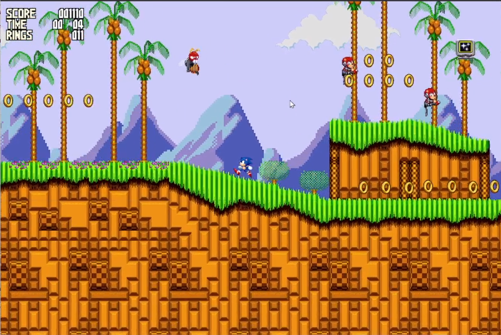
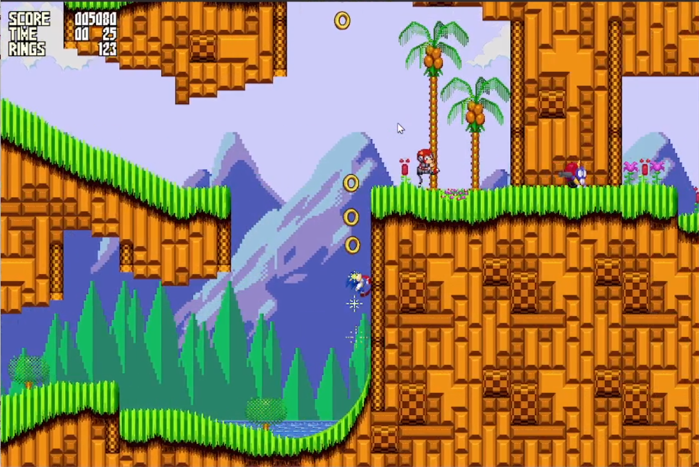
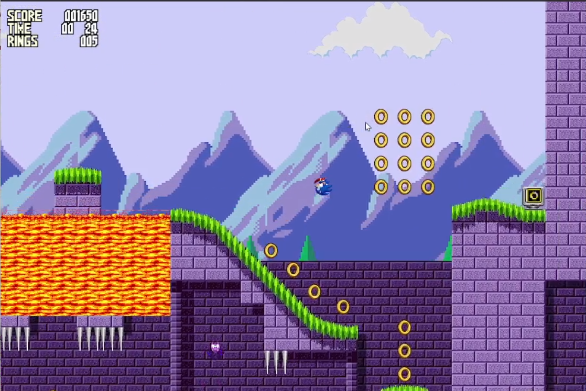
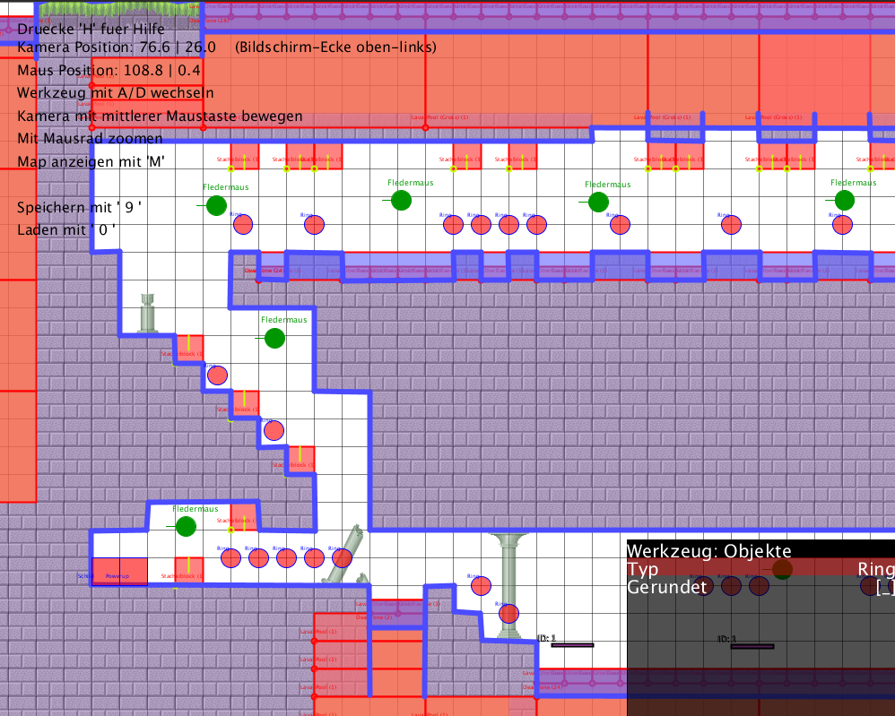

# Sonic the Hedgehog (Java)

This game is a project we did for school. It consists of two programs: the level editor and the base game.
The editor is only really necessary for development, as the game runs without it. The editor generates
level files which are used by the game.

As we passed the deadline, the project is considered finished :-)

## Description

Sonic is a platforming game similar to Mario but faster.

## Features

* Collision detection
* Character Controller
* A bunch of enemies
* Items (Rings, Invincibility, etc.)
* \+ other stuff

## Screenshots

[See demo on YouTube](https://youtu.be/XlsaMCYS4VE)
